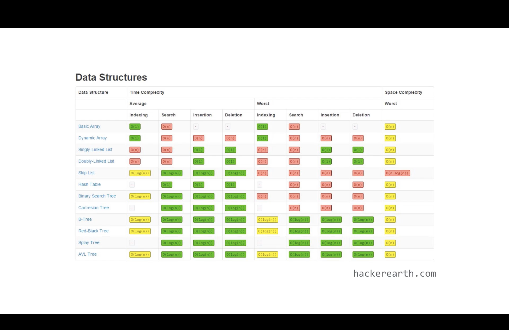

# Data Structures

Data structures are fundamental building blocks that allow you to efficiently organize and manipulate data in various software applications. Here are some reasons why data structures are important for software engineers:

1. `Efficient Data Storage and Retrieval:` Different data structures offer different trade-offs in terms of storage efficiency and retrieval speed. Understanding various data structures helps you choose the most suitable one for specific scenarios, enabling efficient operations like searching, insertion, deletion, and sorting.

2. `Algorithm Design and Analysis:` Data structures are closely related to algorithm design and analysis. Many algorithms and problem-solving techniques rely on specific data structures to achieve optimal performance. Knowing data structures enables you to select or design the most appropriate algorithms to solve a given problem efficiently.

3. `Memory Management:` Understanding data structures helps in efficient memory management. By choosing the right data structures, you can minimize memory usage and optimize memory allocation, leading to more efficient and scalable software applications.

4. `Performance Optimization:` Efficient use of data structures can significantly improve the performance of software applications. By leveraging appropriate data structures, you can reduce time complexity, improve response times, and enhance overall system performance.

5. `Problem Solving:` Data structures are essential tools for solving complex problems. Many programming challenges, interviews, and real-world software problems involve data manipulation and organization. Familiarity with data structures enables you to approach these problems more effectively and design efficient solutions.

6. `Frameworks and Libraries:` Many programming frameworks and libraries provide built-in data structures and APIs. Understanding data structures helps you make the best use of these tools and leverage their features effectively.

7. `Communication and Collaboration:` Data structures are widely used concepts in software engineering discussions, code reviews, and collaborations with other engineers. Having a strong understanding of data structures enables effective communication and collaboration with teammates.

In summary, data structures form the foundation of software development and are crucial for designing efficient algorithms, optimizing performance, and solving complex problems. Having a solid understanding of data structures is invaluable for software engineers and can significantly impact the quality, efficiency, and scalability of their software applications.

## Here are some important data structures that every engineer should be familiar with :

1. `Arrays:` Arrays are a basic data structure that stores a collection of elements of the same type in contiguous memory locations. They offer constant-time access to elements by their index and are used extensively in many algorithms and programming languages.

2. `Linked Lists:` Linked lists are dynamic data structures where each node contains a value and a reference to the next node. They allow efficient insertion and deletion operations, but access to elements is linear in time complexity.

3. `Stacks:` Stacks are a Last-In-First-Out (LIFO) data structure that supports two primary operations: push (add an element to the top) and pop (remove the top element). They are commonly used in situations that require a "last in, first out" ordering, such as function call stacks and expression evaluation.

4. `Queues:` Queues are a First-In-First-Out (FIFO) data structure that supports two primary operations: enqueue (add an element to the back) and dequeue (remove the front element). They are used in scenarios where elements need to be processed in the order they arrive, such as task scheduling and message passing.

5. `Trees:` Trees are hierarchical data structures with nodes connected by edges. Common types of trees include binary trees, binary search trees, and balanced trees like AVL trees and Red-Black trees. Trees are used for efficient searching, sorting, and organizing hierarchical data.

6. `Graphs:` Graphs are a versatile data structure that represents relationships between entities. They consist of nodes (vertices) connected by edges and are used in various domains, including social networks, network routing, recommendation systems, and more.

7. `Hash Tables:` Hash tables (also known as hash maps) provide fast access to data by using a hash function to map keys to values. They offer constant-time average case lookup, insertion, and deletion operations, making them efficient for storing and retrieving data based on a key.

8. `Heaps:` Heaps are complete binary trees that satisfy the heap property, which can be either a max-heap or a min-heap. They are used to efficiently maintain the maximum or minimum element and are commonly used in priority queues and sorting algorithms.

These are some of the fundamental data structures that are widely used in software development. While the list is not exhaustive, understanding these data structures and their properties will provide a strong foundation for solving various programming problems and designing efficient algorithms.

# Learn more

- [JavaScript Built-in Data Structures](./01_built_in_ds/00_built_in_ds.md)
- [Linear Data Structures](./02_linear_ds/00_linear_ds.md)
- [Non Linear Data Structures](./03_non_linear_ds/00_non_linear_ds.md)

## Cheat sheet for different time and space complexities

